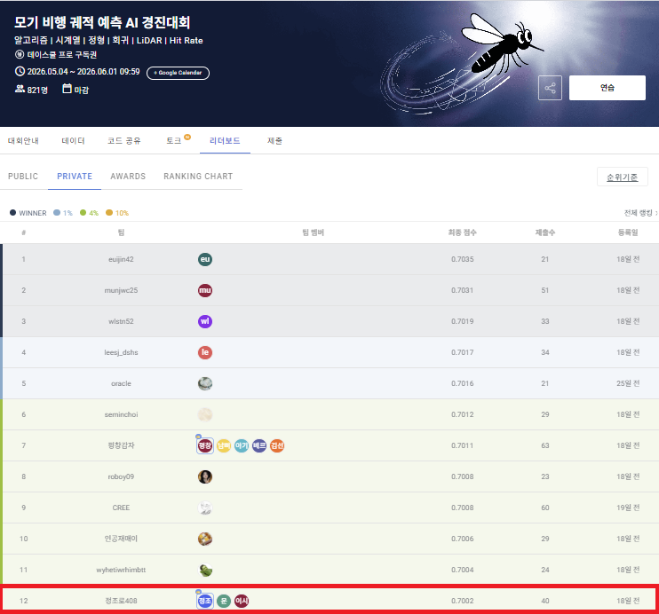

# 모기 비행 궤적 예측 (Mosquito Flight Trajectory Prediction)

물리 기반 추론 decoder + RNN 앙상블로 모기의 다음 위치를 예측하는 프로젝트.
**월간 데이콘 「모기 비행 궤적 예측 AI 경진대회」** 출품작 — 최종 LB **0.7002**, **12등 / 821명**.


## 문제 정의

LiDAR 기반 능동 센서로 빠르게 움직이는 모기를 탐지·조준할 때, 스캔·좌표변환·제어 지연으로 탐지 시점과 조사 시점 사이에 표적이 이동한다. 직전 궤적으로부터 **80ms 뒤 위치**를 예측해 이 지연을 보정하는 것이 과제.

| 항목 | 내용 |
|---|---|
| 평가 | Hit Rate @ r = 1cm (3D Euclidean) |
| 입력 | 11 포인트, 40ms 간격 (t = −400ms ~ 0ms) |
| 예측 | t = +80ms의 (x, y, z) (sensor-local, m) |
| 규모 | train / test 각 10,000 sample |

## 결과

최종 **Private LB 0.7002 · 12등 / 821명**.



## 접근

핵심 모델은 **Rotation-gated 물리 decoder** (단일 MLP, physics-structured):

```
pred = p_last + R · [ w_v · e^(−exp_v) · rodrigues(v_EMA, ω) + w_a · e^(−exp_a) · a_EMA ]
```

등속(CV) 직선 외삽이 못 따라가는 **곡률·급기동 구간**(acc_mag ≥ 5 m/s², minority 15.8%)이 순위를 가르는 표적. 학습된 **rotation gate**(ω)가 이 곡선 외삽을 담당한다.

## 노트북

LB를 갱신한 핵심 노트북 10개만 보존 (`01`~`10`).

| 파일 | 내용 | LB |
|---|---|---|
| `01_v3_baseline.ipynb` | v3 baseline | 0.6678 |
| `02_frenet_target.ipynb` | Frenet target | 0.6878 |
| `03_frenet_multiseed.ipynb` | multi-seed | 0.6888 |
| `04_axiswise_sigma.ipynb` | axis-wise sigma | 0.6906 |
| `05_topk_k15.ipynb` | top-k (k=15) | 0.6906 |
| `06_split_selector.ipynb` | split selector | 0.6910 |
| `07_soft_sweep.ipynb` | soft sweep | 0.6914 |
| `08_t_grid.ipynb` | t-grid | 0.6916 |
| `09_rnn_aug.ipynb` | RNN augmentation | 0.6920 |
| `10_rotgate.ipynb` ⭐ | **Rotation-gated decoder** | 0.7002 |

상세 설계는 [`RESEARCH.md`](RESEARCH.md), 전체 실험 로그는 [`EXPERIMENTS.md`](EXPERIMENTS.md) 참조.

## 데이터

대회 데이터(`open/`)와 외부 참고 코드(`references/`)는 라이선스·용량 문제로 저장소에 포함하지 않는다. 데이터는 데이콘 대회 페이지에서 받을 수 있다.
